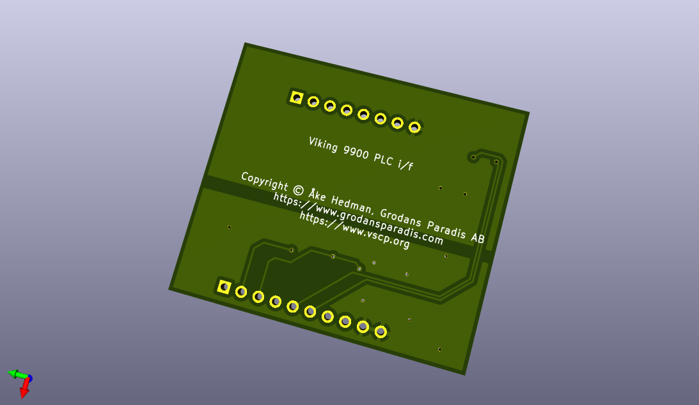

# vscp-demo-viking-9900
PLC interface for Viking 9900 pellets burner to CAN4VSCP Beijing and Accra modules

**Note!** This is still a prototype.

## PCB's

  

---

Part of the [VSCP Project](https://www.vscp.org).

Copyright 2021 © Åke Hedman, (Grodans Paradis AB)[https://www.grodansparadis.com]